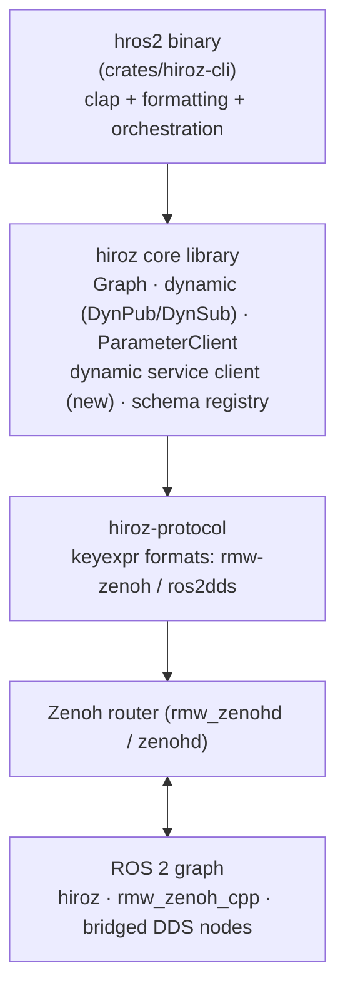

# hros2 CLI — Specification

**Status: Draft — not yet implemented.**

`hros2` is a pure-Rust command-line tool for introspecting and interacting
with a live ROS 2 graph, built entirely on the hiroz stack. It mirrors the
command surface of the standard `ros2` CLI (`ros2 topic`, `ros2 node`,
`ros2 service`, …) so existing muscle memory and scripts transfer directly —
but it requires **no ROS 2 installation, no Python, and no DDS**. A single
static binary talks to the graph through a Zenoh router.

!!! note
    This document is a design specification. It defines the command surface,
    architecture, and delivery phases for the tool before implementation
    begins. Where behavior is compared to the `ros2` CLI, the reference is
    ROS 2 Jazzy.

## Motivation

The standard `ros2` CLI requires a full ROS 2 installation plus the message
packages of every type it touches. On a robot, a CI runner, or a developer
laptop that only runs hiroz (or `rmw_zenoh_cpp`) nodes, that is a heavy
dependency for what amounts to graph queries and pub/sub plumbing.

hiroz already contains all the machinery a CLI needs:

- **Graph introspection** (`hiroz::graph::Graph`) — nodes, topics, services,
  actions, endpoints, counts, QoS.
- **Dynamic messages** (`hiroz::dynamic`) — subscribe to and publish on any
  topic without compile-time knowledge of the type, using runtime schema
  discovery through the ROS 2 Type Description service (REP-2016).
- **Parameter client** (`hiroz::parameter::ParameterClient`) — the full
  `ros2 param`-compatible service set.

[hiroz-console](./console.md) proves the approach: its `--headless --echo`
mode is already a working prototype of `topic echo` for arbitrary types.
`hros2` factors that capability into a scriptable, `ros2`-compatible CLI,
while the console remains the interactive/monitoring TUI.

## Goals

1. **Command-level compatibility** with the `ros2` CLI for the graph
   introspection and interaction verbs (`node`, `topic`, `service`,
   `action`, `param`, `interface`), including argument names and output
   shapes close enough that typical scripts port with only the binary name
   changed.
2. **Zero ROS dependency** — a single static binary per platform, working
   against any `rmw_zenoh_cpp` or hiroz deployment.
3. **Universal types** — every data-plane command (`echo`, `pub`, `hz`,
   `bw`, `call`) works with any message type discoverable at runtime, with
   no local `.msg` files or recompilation.
4. **Script-first output** — every command supports `--format json` (and
   YAML) with stable, documented schemas, in addition to human-readable
   default output.
5. **Thin frontend** — the CLI contains argument parsing, formatting, and
   orchestration only. All protocol capability lives in the `hiroz` library
   crates so that Python/Go bindings and other tools inherit it.

## Non-Goals

- **`ros2 run` / `ros2 launch` / `ros2 pkg`** — package management and
  process launch are workspace/ament concerns, out of scope for a
  graph-interaction tool.
- **`ros2 daemon`** — the `ros2` CLI needs a discovery daemon because DDS
  discovery is slow and per-process. hiroz discovery is centralized at the
  Zenoh router, so there is nothing to daemonize; `hros2 daemon` is
  intentionally absent.
- **`ros2 bag`** — recording/playback is a large, separate effort
  (candidate for a future `hros2 bag` built on `DynSub` + an MCAP writer,
  but explicitly not part of this spec).
- **`ros2 security`, `ros2 multicast`** — DDS-specific; not applicable to
  the Zenoh transport.
- **A TUI** — that is [hiroz-console](./console.md)'s job.

## Architecture

A new workspace crate `crates/hiroz-cli` producing the binary `hros2`.



Design rules:

- **Library-first.** Any capability the CLI needs that hiroz lacks (see
  [Required library work](#required-library-work)) is implemented in
  `crates/hiroz` behind a public API, then consumed by the CLI. The CLI
  crate depends on `hiroz`, `hiroz-msgs` (for `rcl_interfaces`,
  `lifecycle_msgs`, and other well-known types), `clap` (derive),
  `tokio`, `serde_json`, `serde_yaml`, and `anyhow`.
- **One short-lived hidden node.** Each invocation creates a `ZContext` and
  a single node named `_hros2_cli_<pid>` in namespace `/`, mirroring the
  `ros2` CLI's `_ros2cli_*` daemon nodes. Commands that are pure graph
  reads use the graph observer without creating discoverable endpoints
  where possible (the zero-interference model proven by hiroz-console).
- **Async internally, synchronous UX.** `#[tokio::main]`, structured with
  per-command timeouts. `Ctrl-C` always exits cleanly (flush output,
  destroy endpoints).
- **Errors** are reported via `anyhow` context chains on stderr; stdout
  carries only command output so pipelines stay clean.

### Connection model

hiroz has no multicast discovery: a Zenoh router must be reachable. The
CLI resolves its connection in this order:

1. `--router <ENDPOINT>` flag
2. `HROS2_ROUTER` environment variable
3. Default `tcp/127.0.0.1:7447`

The domain ID resolves from `--domain`, then `ROS_DOMAIN_ID`, then `0` —
matching `ros2` CLI conventions.

### Global options

Available on every subcommand:

| Flag | Env var | Default | Description |
|------|---------|---------|-------------|
| `-r, --router <ENDPOINT>` | `HROS2_ROUTER` | `tcp/127.0.0.1:7447` | Zenoh router endpoint |
| `-d, --domain <ID>` | `ROS_DOMAIN_ID` | `0` | ROS domain ID |
| `--backend <BACKEND>` | `HROS2_BACKEND` | `rmw-zenoh` | Key-expression format: `rmw-zenoh` (nodes on `rmw_zenoh_cpp`/hiroz) or `ros2dds` (nodes behind `zenoh-bridge-ros2dds`) |
| `--format <FMT>` | — | `human` | Output format: `human`, `json`, `yaml` |
| `--timeout <SECS>` | — | `5` | Discovery/service timeout |
| `--spin-time <SECS>` | — | `1` | Graph settle time before list/info commands read the graph (parity with `ros2` `--spin-time`) |
| `-q, --quiet` / `-v, --verbose` | `RUST_LOG` | — | Log verbosity (logs go to stderr via `tracing`) |

!!! tip
    `--format json` emits one JSON document per result — or one JSON object
    per line for streaming commands (`echo`, `hz`) — so output composes
    directly with `jq`.

## Command surface

### Parity matrix

| `ros2` command | `hros2` | Phase | Notes |
|----------------|:-------:|:-----:|-------|
| `node list` | ✅ | 1 | `Graph::get_node_names()` |
| `node info` | ✅ | 1 | `Graph::get_names_and_types_by_node`, action server/client queries |
| `topic list` | ✅ | 1 | `Graph::get_topic_names_and_types()` |
| `topic info` | ✅ | 1 | `Graph::get_entities_by_topic` (incl. QoS with `--verbose`) |
| `topic type` / `find` | ✅ | 1 | Graph queries |
| `topic echo` | ✅ | 1 | `ZNode::create_dyn_sub_auto` (REP-2016 discovery) |
| `topic hz` / `bw` | ✅ | 1 | Raw subscriber + rate/bandwidth windows (port of console measurement) |
| `topic pub` | ✅ | 1 | `ZNode::create_dyn_pub` + YAML → `DynamicMessage` |
| `topic delay` | ⏩ | future | Needs `std_msgs/Header` heuristics; low value initially |
| `service list` / `type` / `find` | ✅ | 1 | `Graph::get_service_names_and_types()` |
| `service info` | ✅ | 1 | `Graph::get_entities_by_service`, `count_by_service` |
| `service call` | ✅ | 2 | Requires new **dynamic service client** in hiroz |
| `service echo` | ⏩ | future | Requires service introspection events |
| `action list` / `info` / `type` | ✅ | 2 | `Graph::get_action_names_and_types()` and per-node queries |
| `action send_goal` | ✅ | 3 | Requires new **dynamic action client** in hiroz |
| `param list` / `get` / `set` / `describe` | ✅ | 2 | `ParameterClient` (exists today) |
| `param dump` / `load` | ✅ | 2 | `ParameterClient` + `parameter::yaml` |
| `param delete` | ✅ | 2 | Set to `ParameterValue::NotSet` (undeclare), matching rcl semantics |
| `interface list` / `packages` / `package` | ✅ | 2 | Bundled codegen assets + types observed live on the graph |
| `interface show` | ✅ | 2 | Live: REP-2016 `get_type_description`; offline: bundled assets |
| `interface proto` | ✅ | 3 | Generate a zero-valued YAML prototype from a `MessageSchema` |
| `lifecycle nodes` / `get` / `list` / `set` | ✅ | 3 | Typed clients on `lifecycle_msgs` services (types known at compile time) |
| `doctor` / `wtf` | ✅ | 3 | Router reachability, graph sanity, type-hash mismatch scan |
| `run`, `launch`, `pkg`, `daemon`, `bag`, `security`, `multicast`, `component`, `extension_points`, `extensions` | ❌ | — | Out of scope (see Non-Goals) |

### `hros2 node`

```console
$ hros2 node list
/talker
/listener

$ hros2 node info /talker
/talker
  Subscribers:
    /parameter_events: rcl_interfaces/msg/ParameterEvent
  Publishers:
    /chatter: std_msgs/msg/String
    /rosout: rcl_interfaces/msg/Log
  Service Servers:
    /talker/describe_parameters: rcl_interfaces/srv/DescribeParameters
    ...
  Service Clients:

  Action Servers:

  Action Clients:
```

- `list` supports `--count-nodes` and `--all` (include hidden `_`-prefixed
  nodes, which are excluded by default — including `hros2`'s own node).
- Output layout matches `ros2 node info` section-for-section so diff-based
  test assertions against the real CLI are possible.

### `hros2 topic`

```console
$ hros2 topic list -t
/chatter [std_msgs/msg/String]
/rosout [rcl_interfaces/msg/Log]

$ hros2 topic echo /chatter
data: 'Hello World: 12'
---

$ hros2 topic echo --format json /cmd_vel | jq .linear.x

$ hros2 topic pub --rate 10 /cmd_vel geometry_msgs/msg/Twist \
    '{linear: {x: 1.0}, angular: {z: 0.5}}'

$ hros2 topic hz /chatter
average rate: 10.002
        min: 0.099s max: 0.101s std dev: 0.00042s window: 50
```

Subcommand details:

- **`echo <TOPIC> [TYPE]`** — type is discovered automatically via
  `create_dyn_sub_auto`; an explicit `TYPE` argument skips discovery when
  the schema is in the local registry (bundled well-known types). Flags:
  `--once`, `--times N`, `--field <path>` (dotted field selector),
  `--no-arr` (elide arrays), `--truncate-length N`, `--qos-reliability`,
  `--qos-durability`, `--qos-depth`, `--csv`. Human output is
  block-style YAML with `---` separators, byte-compatible with
  `ros2 topic echo` for the common cases.
- **`pub <TOPIC> <TYPE> [VALUES]`** — `VALUES` is YAML, identical syntax to
  `ros2 topic pub`. The YAML is validated against the `MessageSchema`
  (obtained from the bundled registry, a live publisher, or a node serving
  the type) and converted to a `DynamicMessage`; unknown fields are an
  error, omitted fields take schema defaults/zero values. Flags: `--once`
  / `-1`, `--rate HZ` (default 1), `--times N`, `--keep-alive SECS`,
  QoS flags as for `echo`.
- **`hz` / `bw <TOPIC>`** — use a raw (payload-agnostic) subscriber, so they
  work even when schema discovery fails; port the windowed rate/bandwidth
  measurement from `hiroz-console`. Flags: `--window N`, `--filter <EXPR>`
  is out of scope.
- **`info <TOPIC>`** — endpoint counts by default; `--verbose` adds
  per-endpoint node name, GID, and QoS profile from graph data.
- **`find <TYPE>`** / **`type <TOPIC>`** — direct graph queries; `find`
  supports `--include-hidden-topics`.

!!! info "Type hashes"
    In `rmw-zenoh` backend mode, publishing requires the RIHS01 type hash to
    be part of the key expression. `hros2 topic pub` resolves the hash from
    (in order) a live endpoint of the same type on the graph, the bundled
    schema registry, or a `--type-hash` flag. In Humble-compatible builds
    (`no-type-hash`), this constraint disappears.

### `hros2 service`

```console
$ hros2 service list -t
/talker/describe_parameters [rcl_interfaces/srv/DescribeParameters]

$ hros2 service call /add_two_ints example_interfaces/srv/AddTwoInts '{a: 2, b: 3}'
requester: making request: example_interfaces.srv.AddTwoInts_Request(a=2, b=3)

response:
example_interfaces.srv.AddTwoInts_Response(sum=5)
```

- **`call <SERVICE> <TYPE> [VALUES]`** — needs the new dynamic service
  client (Phase 2). Request YAML handling is identical to `topic pub`.
  Flags: `--rate HZ` (repeat calls), `--timeout SECS`. The human response
  rendering follows `ros2` conventions; `--format json` emits
  `{"request": ..., "response": ...}`.
- **`list` / `type` / `find` / `info`** — pure graph reads (Phase 1).

### `hros2 action`

```console
$ hros2 action list -t
/fibonacci [action_tutorials_interfaces/action/Fibonacci]

$ hros2 action info /fibonacci
Action: /fibonacci
Action clients: 1
    /teleop
Action servers: 1
    /fibonacci_action_server

$ hros2 action send_goal --feedback /fibonacci \
    action_tutorials_interfaces/action/Fibonacci '{order: 5}'
```

- `list` / `info` / `type` are graph reads over the action endpoint kinds
  (`EndpointKind::ActionServer` etc.) — Phase 2.
- `send_goal` composes the dynamic service client (send goal, get result)
  and a dynamic subscriber (feedback, status) — Phase 3. Flags:
  `--feedback`, `--timeout`.

### `hros2 param`

```console
$ hros2 param list /talker
  use_sim_time

$ hros2 param get /talker use_sim_time
Boolean value is: False

$ hros2 param set /talker use_sim_time true
Set parameter successful

$ hros2 param dump /talker
/talker:
  ros__parameters:
    use_sim_time: false
```

All verbs map 1:1 onto the existing `ParameterClient`:

| Verb | `ParameterClient` API |
|------|-----------------------|
| `list [NODE]` | `list()` (all nodes when `NODE` omitted, via graph node enumeration) |
| `get NODE NAME` | `get()` |
| `set NODE NAME VALUE` | `set()` (value parsed as YAML scalar → `ParameterValue`, matching `ros2 param set` coercion rules) |
| `delete NODE NAME` | `set()` with `ParameterValue::NotSet` |
| `describe NODE NAME…` | `describe()` |
| `dump NODE` | `list()` + `get()` → `parameter::yaml` document |
| `load NODE FILE` | `parameter::yaml` parse → `set_atomically()` |

### `hros2 interface`

Interface commands answer from two sources, merged: the **bundled schema
assets** compiled into the binary (the same package set as `hiroz-msgs`:
`std_msgs`, `geometry_msgs`, `sensor_msgs`, `rcl_interfaces`, …) and the
**live graph** (types currently in use, with full definitions retrievable
over REP-2016 `get_type_description` from any node serving the type).

```console
$ hros2 interface show std_msgs/msg/String
string data

$ hros2 interface show /chatter --from-graph   # resolve type live from a topic
```

- `list` supports `--only-msgs`, `--only-srvs`, `--only-actions`.
- `show` renders the canonical `.msg`-style definition from a
  `MessageSchema`; `--all-comments`/`--no-comments` follow `ros2` flags
  where the schema carries comments (bundled assets do; REP-2016
  descriptions do not).
- `proto <TYPE>` emits a zero-valued YAML skeleton ready to paste into
  `topic pub`/`service call` (Phase 3).

### `hros2 lifecycle`

Lifecycle interaction uses ordinary typed service clients against
`lifecycle_msgs` (compiled into the binary), so no dynamic machinery is
needed:

- `nodes` — nodes exposing `~/get_state` (graph scan)
- `get <NODE>` / `list <NODE>` / `set <NODE> <TRANSITION>` — thin wrappers
  over `GetState`, `GetAvailableTransitions`, `ChangeState`.

### `hros2 doctor`

A diagnostic sweep, replacing the network/platform checks of `ros2 doctor`
with Zenoh-relevant ones:

1. Router reachability and round-trip latency for the configured endpoint.
2. Graph summary: node/topic/service counts, hidden-node census.
3. Consistency checks: topics with publishers but no subscribers (and vice
   versa), QoS incompatibilities (reliability/durability mismatches),
   RIHS01 type-hash conflicts on the same topic.
4. Backend sanity: warn when the graph looks like the *other* backend's
   key-expression format (common misconfiguration).

Exit code reflects findings (see below), so `hros2 doctor` slots into CI
health checks.

## Output and exit-code contract

- **stdout** — command results only. **stderr** — logs, progress, errors.
- `--format json`: single commands emit one JSON document; streaming
  commands (`echo`, `hz`, `bw`, `send_goal --feedback`) emit one JSON
  object per line. JSON field names are stable API from 1.0.
- Exit codes: `0` success · `1` runtime error (unreachable router, service
  timeout) · `2` usage error (clap) · `3` not found (topic/node/service/
  param absent) · `4` type error (schema mismatch, bad YAML values) ·
  for `doctor`: `0` healthy, `3` warnings, `1` failures.

## Required library work

The CLI is a thin frontend; these capabilities land in `crates/hiroz`
first, each independently useful to library users:

1. **Dynamic service client** (`Phase 2`, blocks `service call`) —
   `ZNode::create_dyn_client(service, schema_pair)` plus
   `create_dyn_client_auto(service, timeout)` mirroring
   `create_dyn_sub_auto`: resolve the `.srv` request/response schemas via
   the graph + REP-2016, then CDR-serialize a `DynamicMessage` request and
   deserialize the reply. Builds directly on the existing
   `dynamic::type_description` conversion and `DynamicSerdeCdrSerdes`.
2. **Service schema support in the schema registry** — extend
   `SchemaRegistry` to hold request/response pairs keyed by service type
   name, and extend the bundled-asset loader to register `.srv` types.
3. **Dynamic action client** (`Phase 3`, blocks `action send_goal`) —
   composition of (1) for `send_goal`/`get_result` and a `DynSub` for
   feedback/status, following the action key-expression layout in
   `hiroz-protocol`.
4. **Schema → canonical text rendering** (`Phase 2`, blocks
   `interface show`) — pretty-printer from `MessageSchema` to `.msg`
   syntax; lives beside the existing schema model.
5. **YAML → `DynamicMessage`** (`Phase 1`, blocks `topic pub`) —
   schema-checked conversion from `serde_yaml::Value` (strict on unknown
   fields, defaulting for omitted ones). The inverse
   (`dynamic_message_to_json`) already exists in hiroz-console and moves
   into `hiroz::dynamic` so both tools share one formatter, gaining a YAML
   renderer for `ros2`-compatible `echo` output.

## Build, distribution, and distro handling

- **Crate:** `crates/hiroz-cli`, binary `hros2`, edition 2024, added to the
  workspace and to the release matrix alongside `hiroz-console`
  (`bin-hros2-x86_64-linux`, `bin-hros2-aarch64-linux`,
  `bin-hros2-aarch64-macos`), plus `cargo install --path crates/hiroz-cli`.
- **Distro is compile-time** in hiroz (`jazzy` default; `humble`, `kilted`,
  `lyrical` are mutually exclusive features gating type-hash behavior and
  bundled message sets). `hros2` therefore ships per-distro builds; the
  default artifact targets the current LTS. `hros2 --version` prints the
  distro flavor and backend defaults. A runtime distro switch is
  explicitly out of scope until hiroz itself supports it.
- **Feature flags:** the CLI re-exports the distro features and a
  `protobuf` passthrough; `default = ["jazzy"]`.

## Testing strategy

1. **Unit** — YAML↔`DynamicMessage` conversion, output formatters, field
   selectors, exit-code mapping (no network).
2. **In-process integration** — spin up hiroz nodes and the CLI's command
   functions against a `zenohd` in the test harness (pattern already used
   by `hiroz-tests`): every subcommand exercised against known graph
   fixtures.
3. **Interop / parity** — extend the existing docker-compose harness
   (hiroz container ↔ ROS 2 Jazzy container) to run `ros2 <cmd>` and
   `hros2 <cmd>` against the same live graph and diff normalized outputs
   for the parity-matrix commands (`node list/info`, `topic list/info/
   echo`, `service list`, `param get/set/list`). This makes "clone of the
   ros2 cli" a tested property, not an aspiration.
4. **Round-trip** — `hros2 topic pub` → `ros2 topic echo` and vice versa,
   for primitives, nested types, arrays, and a custom type served only via
   REP-2016.

## Delivery phases

| Phase | Scope | Depends on |
|:-----:|-------|------------|
| **1** | Crate skeleton, global options, `node *`, `topic list/info/type/find/echo/hz/bw/pub`, `service list/type/find/info`, JSON/YAML output, interop parity harness | Library items 5 (YAML→DynamicMessage) |
| **2** | `param *`, `service call`, `action list/info/type`, `interface list/show/package(s)` | Library items 1, 2, 4 |
| **3** | `action send_goal`, `lifecycle *`, `interface proto`, `doctor` | Library item 3 |

Each phase is releasable on its own; the parity matrix above is the
acceptance checklist per phase.

## Open questions

- **Command name for hidden-node filtering** — `ros2` hides `_ros2cli_*`
  by leading-underscore convention; hiroz graph queries return everything.
  Decide whether hidden filtering lives in `Graph` (useful to console too)
  or in the CLI.
- **`topic echo --qos-*` defaults** — `ros2 topic echo` adapts its QoS to
  the publisher's offered QoS. Adopt the same adaptive behavior, or
  default to sensor-data QoS with explicit flags?
- **Shell completions** — clap can generate bash/zsh/fish completions;
  decide whether to ship them in release artifacts (`hros2 completions
  <shell>` subcommand is the likely answer).
- **`hros2` vs `ros2` argument incompatibilities** — `--router`/`--backend`
  have no `ros2` equivalent; conversely `ros2`'s `--ros-args` passthrough
  is meaningless here. Document the delta in a migration table once the
  flag set stabilizes.
